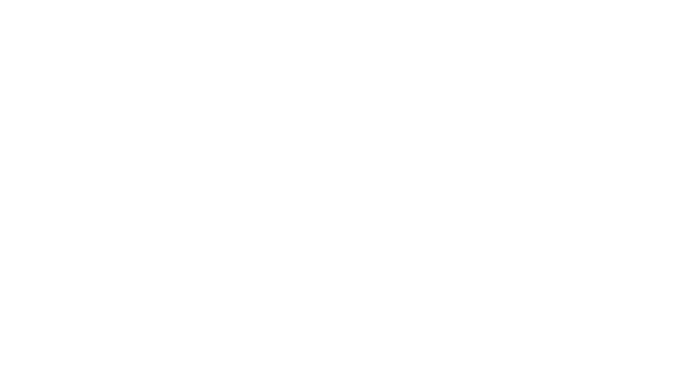

 # 👋 Hey there! I'm Fatma

## 👨‍💻 About Me

I'm a CS student exploring the world of tech  
Still figuring things out, learning as I go, and having fun along the way! ✨    
🌐 Interested in Web Development & AI  
🎨 I practice Design as a hobby .....and a sort of a creative escape  

Just here to store my projects and tasks because my laptop doesn’t have enough space… 
oh…! I mean..... to improve myself, learn git and GitHub, track my progress and build a little portfolio while I’m still learning     

---

## 🌱 What I’m learning
- Front-end web development
- UI/UX
- AI
- project management basics
- problem solving 

---

## 💻 Tech Stack

### 🧠 Programming Languages

---

### 🌐 Web

---

### 🤖 AI & Data Science

---

### 🛠 Tools & Platforms

 

---

## 📊 GitHub Stats

   

  
  

---

✨"Sometimes you gotta run before you can walk."✨

